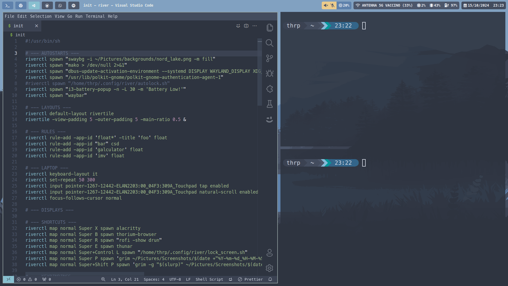

# riverwm-dotfiles
 My personal configuration for river wm

---

Dependencies:
- [river](https://codeberg.org/river/river/src/branch/master) (with Xwayland support)
- [waybar](https://github.com/Alexays/Waybar)
- [mako](https://github.com/emersion/mako)
- [swaylock](https://github.com/swaywm/swaylock)
- [swayidle](https://github.com/swaywm/swayidle)
- [swaybg](https://github.com/swaywm/swaybg)
- gnome-polkit (or others)
- [i3-battery-popup](https://github.com/rjekker/i3-battery-popup) (optional)
- [grim](https://github.com/emersion/grim)
- [slurp](https://github.com/emersion/slurp)
- [wl-clipboard](https://github.com/bugaevc/wl-clipboard)
- wofi (or others)
- [brightnessctl](https://github.com/Hummer12007/brightnessctl) (only for laptops)
- [pamixer](https://github.com/cdemoulins/pamixer) 

---

